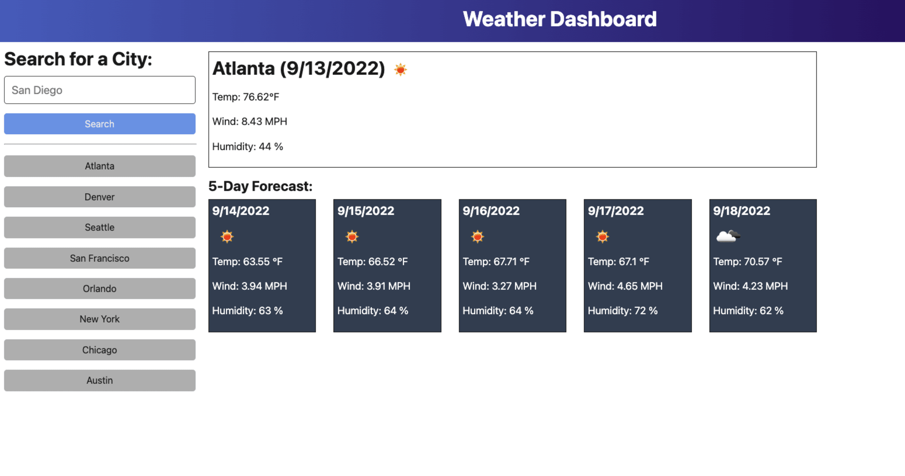

# weather-app

## Description
A weather dashboard that provides the current temperature, wind and humidity of a user inputed city. Additionally, there is a 5-day forecast with the same three attributes. 

## Installation 
N/A

## Usage 
Deployed application link:  https://kaikim1996.github.io/weather-app/
Provided image of what the application UI should look like: 

## Lisence 
Please refer to the repo. 

